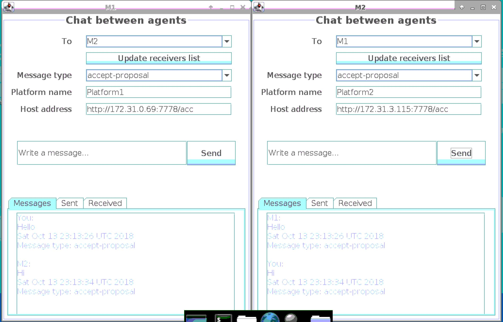

# Network Programming Course

## Introduction
This Network Programming assignment was completed as a part of course D7001D Network programming and distributed applications at Lulea University of Technologies during 2018-2019 studying year.
The course is a part of [PERCCOM Master Program](http://perccom.univ-lorraine.fr/).

## Aims & Objectives
Communication between remote platforms using Java agents with simple messenger GUI

**Studying objectives**
- to implement a simple messenger GUI
- to realize server-client interaction with multithreaded TCP server
- to demonstrate inter-platform communication between agents using two Amazon Web Services (AWS) instances 

## Tools
- Java Programming Language, Java Agent Development Framework (JADE)
- AWS Management Console

## Results
1. The agents are able to recognize each other when run on the same instance (platform) and communicate.
2. The agents are able to communicate being run from different platforms and informed about public IP addresses of another platform

## Acknowledgements
PERCCOM Family
